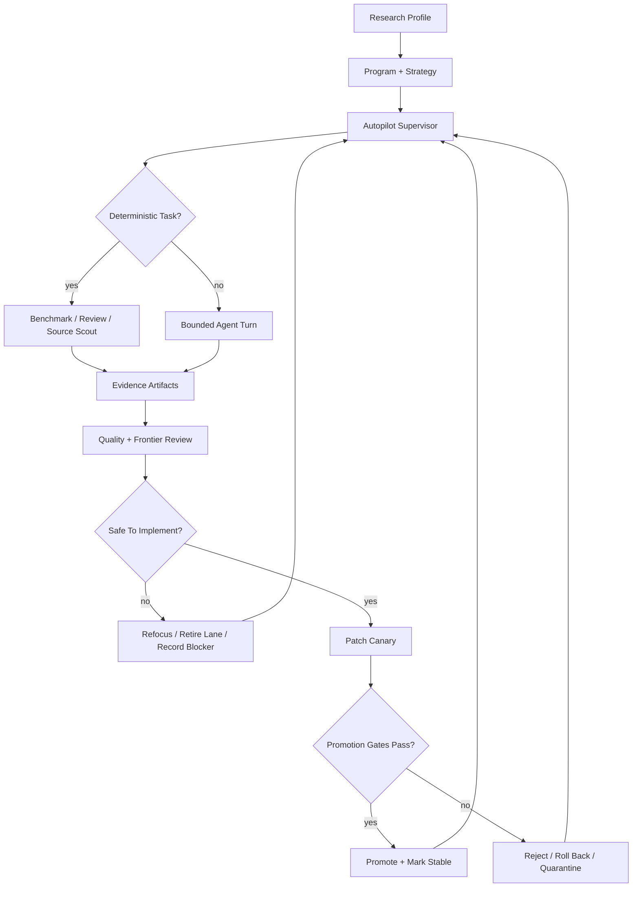
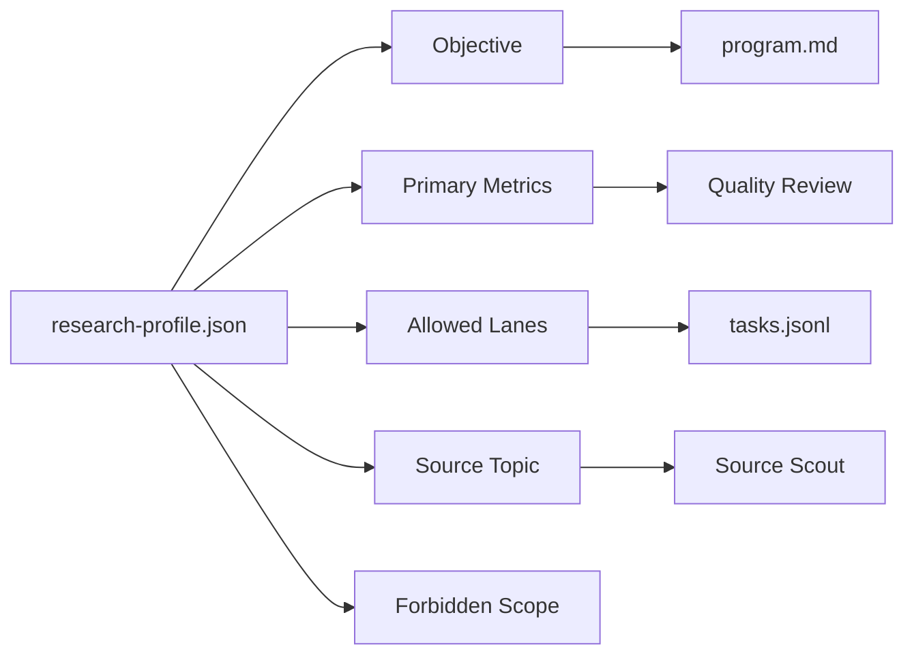
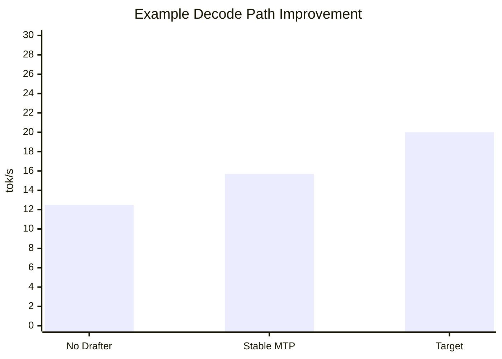
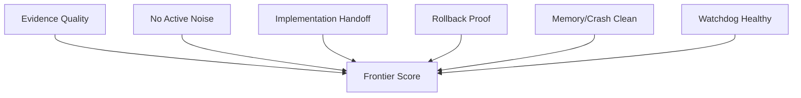

# OpenClaw Harness Autoresearch

A hardened OpenClaw-only research harness for local agent work on Apple Silicon.

The project started as a local speed/reliability harness for OpenClaw running
Gemma 4 JANG/JANQ, then grew into a modular autoresearch system. It keeps
Karpathy-style autoresearch at the core: small experiments, evidence-first
notes, TSV logs, and keep/discard decisions. On top of that, it adds production
guardrails for local LLM agents: memory gates, deterministic supervisors,
quality reviewers, implementation handoff, rollback rules, and modular research
profiles.

It does **not** manage opencode.

## What This Adds To Karpathy Autoresearch

Karpathy's `autoresearch` pattern is the base loop:

```text
question -> experiment -> result -> keep/discard -> next question
```

This repo adds the harness needed to run that loop safely inside a local
OpenClaw agent setup:

| Layer | Added Capability |
| --- | --- |
| Runtime safety | macOS memory/Metal/Python crash gates before heavy local model work |
| Supervisor | deterministic task routing before model-bound reasoning |
| Evidence ledger | `results.tsv`, JSONL findings, benchmark artifacts, compact summaries |
| Quality review | scorecards for noise, duplicate work, evidence quality, and next actions |
| Implementation handoff | canary patches, allowlists, rollback checks, secret/path scans |
| Self-improvement | advisory lessons, skill variants, shadow review, rollback records |
| Modular profiles | research any topic by swapping objective, metrics, lanes, and sources |
| Watchdog | independent health/quality reviewer that can detect stalls and stale locks |

## System Flow



## Key Features

### Model And Runtime Guardrails

- Profile-driven model backend selection.
- OpenClaw gateway stays model-agnostic.
- Launchers start only the needed OpenClaw-owned backend.
- Memory gates check free memory, compressor, swap, and pressure.
- Interrupt handling writes a neutral checkpoint and stops owned processes.
- Large prompt/tool contexts are preflighted before local MLX execution.

### Proxy And TUI Safety

- SSE deadlines and stream watchdogs prevent silent hangs.
- Tool calls and reasoning streams are bounded and separated.
- Repeated reasoning markers and malformed tool JSON are detected.
- Broad local tool commands are blocked or redirected to narrower paths.
- Prompt-size and tool-result caps reduce context spiral risk.

### Modular Autoresearch

Speed research is now only the default preset. You can research any topic by
setting a profile:

```bash
OPENCLAW_RESEARCH_NAME="design-wiki" \
OPENCLAW_RESEARCH_OBJECTIVE="Build a high-taste design reference wiki with evidence-backed source notes." \
OPENCLAW_RESEARCH_PRIMARY_METRICS="source_quality,coverage,actionability" \
OPENCLAW_RESEARCH_LANES="source-scout,evidence-map,implementation-gate,safety" \
openclaw research --max-hours 4 --cycles 80
```

Generic workspaces live under:

```text
~/.openclaw/research/<profile-slug>
```

Use `OPENCLAW_RESEARCH_DIR=/absolute/path` for an explicit workspace.

### Research Profiles

A profile defines the current research system:



Examples:

| Use Case | Primary Metrics | Suggested Lanes |
| --- | --- | --- |
| Decode speed | `decode_tps,mean_accept,speedup_factor` | `mtp-decode,drafter-alignment,runtime-overhead` |
| Design wiki | `source_quality,coverage,actionability` | `source-scout,evidence-map,implementation-gate` |
| App improvement | `bug_rate,task_success,latency` | `experiment,implementation-gate,safety` |
| Research synthesis | `evidence_quality,novelty,reproducibility` | `source-scout,hypothesis,evidence-map` |

## Metrics

### Runtime Metrics



| Metric | Meaning | Why It Matters |
| --- | --- | --- |
| `decode_tps` | generated tokens per second | raw response speed |
| `ttft_s` | time to first token | perceived snappiness |
| `prefill_tps` | prompt processing speed | long-context startup cost |
| `mean_accept` | accepted draft tokens | speculative decoding quality |
| `memory_before/after` | macOS memory state | crash and pressure risk |
| `measurement_quality` | clean vs contaminated | prevents false speed claims |

### Autonomy Metrics



| Metric | Good State |
| --- | --- |
| Quality score | `>= 99` for promotion |
| Frontier eval | `>= 9.8` for promotion |
| Handoff audit | `100` |
| Active canonical noise | `0` |
| Crash/memory/Metal signals | `0` active blockers |
| Rollback rehearsal | present for promoted patches |

These are intentionally strict. The system fails closed when evidence is
missing.

## Main Commands

Speed preset:

```bash
openclaw speed-research --max-hours 10 --cycles 80
```

Generic profile:

```bash
openclaw research --max-hours 4 --cycles 80
```

Add a source:

```bash
openclaw research-add-source "https://example.com" --kind url --title "Example"
```

Print the current bootstrap prompt:

```bash
openclaw research-prompt
```

Run watchdog review:

```bash
openclaw research-watchdog --allow-degraded
```

Run a decode benchmark for the speed profile:

```bash
openclaw speed-research-benchmark --mode decode-sample
```

## Evidence Files

Each workspace contains:

| File | Purpose |
| --- | --- |
| `research-profile.json` | objective, metrics, lanes, scope |
| `program.md` | installed research policy |
| `STRATEGY.md` | current strategy and synthesis |
| `RUN_MEMORY.md` | durable progress memory |
| `tasks.jsonl` | active and completed work queue |
| `results.tsv` | compact experiment ledger |
| `findings.jsonl` | durable findings |
| `experiments.jsonl` | experiment metadata |
| `benchmarks/*.json` | detailed benchmark/review artifacts |
| `watchdog/*.json` | independent health reports |

## Implementation Safety

Research does not directly mutate production code. Candidate patches go through:


Denied by default:

- opencode files;
- `.env` files;
- passwords, API keys, OAuth tokens, private certificates;
- private model caches;
- runtime logs;
- private local config.

## Referenced Ideas

This is custom OpenClaw harness code inspired by:

- [Karpathy autoresearch](https://github.com/karpathy/autoresearch): small
  evidence-first research loops.
- [DSPy GEPA](https://github.com/stanfordnlp/dspy): reflective policy/program
  optimization ideas.
- [Hermes Agent](https://github.com/NousResearch/hermes-agent): skill memory and
  self-improvement concepts.
- [Rapid-MLX](https://github.com/raullenchai/Rapid-MLX): MLX serving and speed
  ideas.
- [dFlash](https://github.com/z-lab/dflash): speculative decoding and drafter
  research direction.
- [Gemma MTP docs](https://ai.google.dev/gemma/docs/mtp/mtp): multi-token
  prediction/drafter concepts.

External code is not vendored unless it is explicitly present in this repo.

## Repository Layout

```text
openclaw/
  openclaw-wrapper.zsh                 # user-facing wrapper and aliases
  openclaw-model-proxy.py              # OpenAI-compatible proxy guardrails
  openclaw-speed-research.py           # deterministic research helper commands
  openclaw-speed-research-autopilot.py # autonomous supervisor loop
  openclaw-autoresearch-watchdog.py    # independent deterministic reviewer
  openclaw-drafter-fit.py              # JANQ drafter-fit gates
  openclaw-mtp-drafter-calibrate.py    # bounded calibration helpers
  test-*.py                            # safety and behavior tests

launchagents/
  *.plist                              # optional macOS LaunchAgent templates

docs/case-studies/
  *.md                                 # portfolio-readable case study logs
```

## Testing

Common local checks:

```bash
python3 openclaw/test-autonomy-policy.py
python3 openclaw/test-speed-research.py
python3 openclaw/test-speed-research-autopilot.py
python3 openclaw/test-self-improvement.py
python3 openclaw/test-autoresearch-watchdog.py
python3 -m compileall -q openclaw
zsh -n openclaw/openclaw-wrapper.zsh
```

## Secret Hygiene

Before pushing:

```bash
git status --short
find . -maxdepth 3 \( -name '.env*' -o -name '*secret*' -o -name '*token*' -o -name '*key*' -o -name '*.pem' -o -name '*.p12' -o -name 'id_rsa*' -o -name 'id_ed25519*' \) -not -path './.git/*' -print
rg -n "(API_KEY|SECRET|TOKEN|PASSWORD|BEGIN (RSA|OPENSSH|PRIVATE)|sk-[A-Za-z0-9])" --glob '!*.log' --glob '!**/.git/**'
```

Expected matches should be placeholder strings, denied-path tests, environment
variable names, or documentation examples only.
