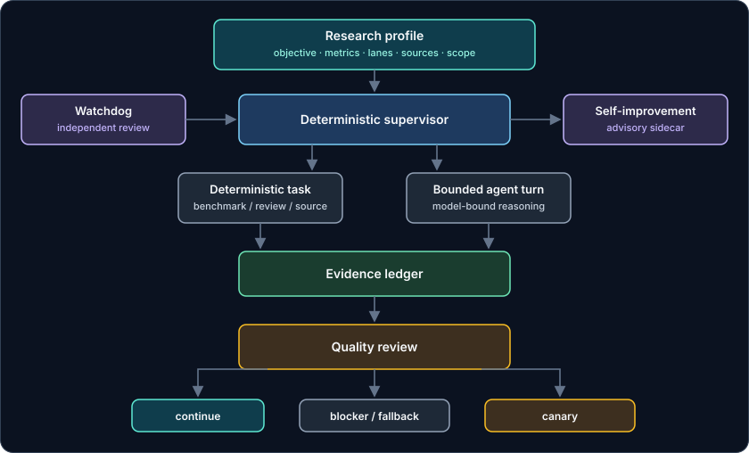
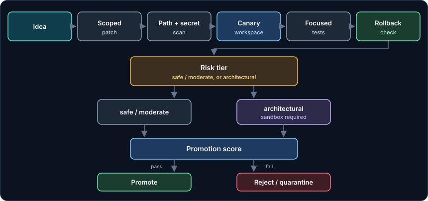

# OpenClaw Harness Autoresearch

Local OpenClaw-only modular autoresearch harness. It runs a Karpathy-style
research loop inside a local agent environment, then adds the engineering
needed to keep that loop evidence-first, gated, and reversible.

[](https://github.com/Kristianaaron/openclaw-harness-autoresearch)
[](#testing)
[](#what-this-is-not)
[](#testing)

```text
question -> experiment -> evidence -> keep/discard -> next question
```

The supervisor prefers deterministic work (benchmark, review, source task)
before a bounded agent turn. Evidence is written to a ledger. Quality review
decides the next action: continue, record a blocker, or open a canary
implementation path. Research does not mutate production code directly.

This repo does not manage opencode. Workspaces live under
`~/.openclaw/research/<profile-slug>`.

## What This Is Not

- Not the npm plugin `@gianfrancopiana/openclaw-autoresearch`.
- Not a port of pi-autoresearch.
- Not a packaged CLI on npm or PyPI. There is no installable package name here.
- Not a fork of [Karpathy autoresearch](https://github.com/karpathy/autoresearch).
  The loop is inspired by that method; the code in this repo is custom
  OpenClaw harness work.
- Not an opencode manager. OpenClaw-owned files only.

## Quick Start

This is a **local Mac / OpenClaw** harness, not a `pip` or `npm` install.
The `openclaw` commands below are aliases from
[`openclaw/openclaw-wrapper.zsh`](openclaw/openclaw-wrapper.zsh), a zsh
autoload function. That wrapper expects a local OpenClaw install (the
checked-in file points at Homebrew `/opt/homebrew/bin/openclaw`) and syncs
helpers from this repo into `~/.openclaw/bin`.

```bash
git clone https://github.com/Kristianaaron/openclaw-harness-autoresearch.git
cd openclaw-harness-autoresearch
export OPENCLAW_HARNESS_REPO="$PWD"
```

`OPENCLAW_HARNESS_REPO` must point at this clone so the wrapper can sync
helpers. If it is unset, the wrapper uses a machine-local default.

Runtime workspaces are **outside** the git repo:

```text
~/.openclaw/research/<profile-slug>
```

Use `OPENCLAW_RESEARCH_DIR=/absolute/path` for an explicit workspace. If you
do not set a profile name, the default slug is `speed`
(`~/.openclaw/research/speed`).

Generic research run (wrapper runs `setup`, then the supervisor):

```bash
OPENCLAW_RESEARCH_NAME="design-wiki" \
OPENCLAW_RESEARCH_OBJECTIVE="Build an evidence-backed design reference wiki." \
OPENCLAW_RESEARCH_PRIMARY_METRICS="source_quality,coverage,actionability" \
OPENCLAW_RESEARCH_LANES="source-scout,evidence-map,implementation-gate,safety" \
openclaw research --max-hours 4 --cycles 80
```

Print the bootstrap prompt without starting a run:

```bash
openclaw research-prompt
```

These commands assume the wrapper is already loaded in your local OpenClaw
zsh environment. They start a local model server and gateway on macOS
(`launchctl`, memory gates). They are not a portable Linux CLI.

## Contents

- [What It Adds](#what-it-adds)
- [How The Loop Works](#how-the-loop-works)
- [Research Profiles](#research-profiles)
- [Key Metrics](#key-metrics)
- [Implementation Safety](#implementation-safety)
- [Commands](#commands)
- [Evidence Files](#evidence-files)
- [Testing](#testing)
- [Secret Hygiene](#secret-hygiene)
- [Referenced Ideas](#referenced-ideas)
- [Repository Layout](#repository-layout)
- [Case Studies](#case-studies)
- [License](#license)

## What It Adds

| Area | What this repo adds |
| --- | --- |
| Research profiles | Swap objective, metrics, lanes, and sources for different research goals |
| Supervisor loop | Routes work through deterministic tasks before model-bound reasoning |
| Evidence ledger | Compact progress in TSV, JSONL, benchmark, and review artifacts |
| Quality review | Scores evidence quality, duplicate work, noise, blockers, and next action |
| Safety gates | Blocks unsafe paths, secrets, private config, broad commands, and stale locks |
| Implementation handoff | Scoped patches, canaries, tests, rollback, and promotion gates |
| Watchdog | Independent health and quality review, separate from the active loop |
| Self-improvement | Lessons and candidate skill updates without mutating blindly |

## How The Loop Works



Quality review returns continue, a blocker / fallback, or a canary path.
Watchdog and self-improvement sit beside the loop; they do not ship patches.

## Research Profiles

A profile defines what the harness is trying to improve. The architecture
diagram treats the profile as the loop entry; the fields below are what it
carries.

| Field | What it shapes |
| --- | --- |
| Objective | Installed policy in `program.md` |
| Metrics | Quality-review scoring |
| Allowed lanes | Work queued in `tasks.jsonl` |
| Sources | Inputs into the evidence ledger |
| Forbidden scope | Safety gates and denied paths |

Set profile fields with environment variables before `openclaw research`, as in
the Quick Start example. `OPENCLAW_RESEARCH_NAME` is slugified into the
workspace directory name.

## Key Metrics

The harness is metric-driven. A research profile can define its own measures;
every run also tracks general system health.

| Metric | What it answers |
| --- | --- |
| Progress | Did the run produce new durable evidence? |
| Evidence quality | Are findings specific, reproducible, and tied to artifacts? |
| Novelty | Is the system avoiding duplicate synthesis and repeated dead ends? |
| Stability | Did memory, process, stream, and tool guards stay clean? |
| Handoff readiness | Is an implementation candidate scoped, testable, and reversible? |
| Promotion safety | Did canary, rollback, and score gates pass? |

## Implementation Safety

Research does not directly mutate production code. Candidate changes move
through a gated implementation path.



Denied by default:

- opencode files
- `.env` files
- passwords, API keys, OAuth tokens, private certificates
- private model caches
- runtime logs
- private local config

Patch classification also rejects path fragments such as `token`, `secret`,
`password`, `id_rsa`, `.pem`, and `.key`. Broad local search (`find ~`,
recursive home greps) is blocked in the research program.

## Commands

Wrapper aliases from [`openclaw/openclaw-wrapper.zsh`](openclaw/openclaw-wrapper.zsh).
Same commands have `research-*`, `speed-research-*`, and `autoresearch-*` names.

| Command | Purpose |
| --- | --- |
| `openclaw research --max-hours 4 --cycles 80` | Run the supervisor loop |
| `openclaw research-prompt` | Print the active bootstrap prompt |
| `openclaw research-setup` | Initialize the workspace without starting the loop |
| `openclaw research-add-source "https://example.com" --kind url --title "Example"` | Add a source (`note`, `url`, `image-url`, `file`, `article`) |
| `openclaw research-watchdog --allow-degraded` | Independent health review |

`--cycles` is a tranche size (autopilot default `48`). `--max-hours` is the
wall-clock budget (autopilot default `8`). Stop with `Ctrl+C`.

## Evidence Files

Each workspace contains:

| File | Purpose |
| --- | --- |
| `research-profile.json` | Objective, metrics, lanes, scope |
| `program.md` | Installed research policy |
| `STRATEGY.md` | Current strategy and synthesis |
| `RUN_MEMORY.md` | Durable progress memory |
| `tasks.jsonl` | Active and completed work queue |
| `results.tsv` | Compact experiment ledger |
| `findings.jsonl` | Durable findings |
| `experiments.jsonl` | Experiment metadata |
| `benchmarks/*.json` | Detailed benchmark/review artifacts |
| `watchdog/*.json` | Independent health reports |

Related files the supervisor also maintains include `rejections.jsonl`,
`ideas.md`, `sources/queue.md`, and `implementation-skill.md`. Keep the
runtime workspace out of git.

## Testing

Common local checks (no GitHub Actions workflow in this repo):

```bash
python3 openclaw/test-autonomy-policy.py
python3 openclaw/test-speed-research.py
python3 openclaw/test-speed-research-autopilot.py
python3 openclaw/test-self-improvement.py
python3 openclaw/test-autoresearch-watchdog.py
python3 -m compileall -q openclaw
zsh -n openclaw/openclaw-wrapper.zsh
```

Additional `openclaw/test-*.py` files cover proxy, launcher, overlay, and
drafter-fit guards.

## Secret Hygiene

Before pushing:

```bash
git status --short
find . -maxdepth 3 \( -name '.env*' -o -name '*secret*' -o -name '*token*' -o -name '*key*' -o -name '*.pem' -o -name '*.p12' -o -name 'id_rsa*' -o -name 'id_ed25519*' \) -not -path './.git/*' -print
rg -n "(API_KEY|SECRET|TOKEN|PASSWORD|BEGIN (RSA|OPENSSH|PRIVATE)|sk-[A-Za-z0-9])" --glob '!*.log' --glob '!**/.git/**'
```

Expected matches should be placeholder strings, denied-path tests, environment
variable names, or documentation examples only.

## Referenced Ideas

This is custom OpenClaw harness code inspired by:

- [Karpathy autoresearch](https://github.com/karpathy/autoresearch): small
  evidence-first research loops.
- [DSPy GEPA](https://github.com/stanfordnlp/dspy): reflective scoring and
  policy/program optimization ideas.
- [Hermes Agent](https://github.com/NousResearch/hermes-agent): skill memory and
  self-improvement concepts.

External code is not vendored unless it is explicitly present in this repo.

## Repository Layout

```text
openclaw/
  openclaw-wrapper.zsh                 # user-facing wrapper and aliases
  openclaw-model-proxy.py              # OpenAI-compatible proxy guardrails
  openclaw-speed-research.py           # deterministic research helper commands
  openclaw-speed-research-autopilot.py # autonomous supervisor loop
  openclaw_speed_research_core.py      # shared workspace and ledger helpers
  openclaw-autoresearch-watchdog.py    # independent deterministic reviewer
  openclaw_self_improvement.py         # sidecar memory and skill evolution
  test-*.py                            # safety and behavior tests

launchagents/
  *.plist                              # optional macOS LaunchAgent templates

docs/assets/
  architecture.svg                     # runtime loop overview
  implementation-safety.svg            # gated handoff, promote, rollback

docs/case-studies/
  *.md                                 # portfolio-readable case studies
```

## Case Studies

Portfolio-readable logs live in [`docs/case-studies/`](docs/case-studies/).
They are separate from live workspace evidence under `~/.openclaw/research/`.

## License

This repository currently has no `LICENSE` file.
