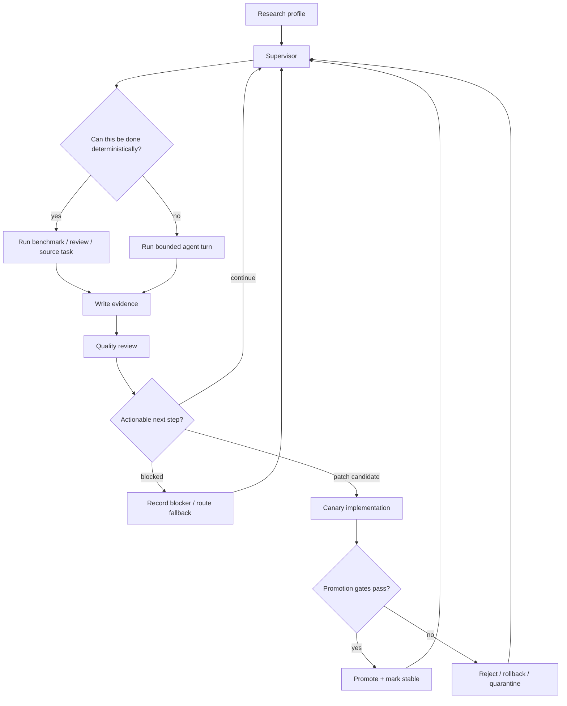
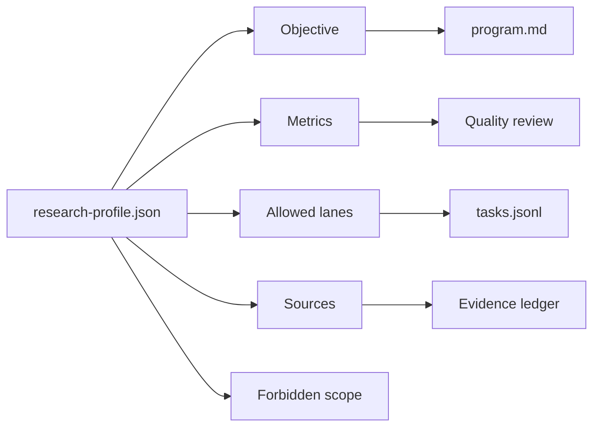
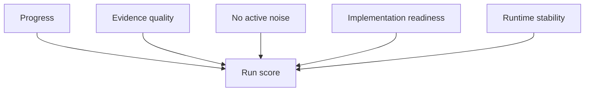
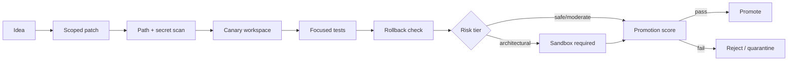

# OpenClaw Harness Autoresearch

A modular autoresearch harness for OpenClaw.

It keeps the simple Karpathy autoresearch loop at the center:

```text
question -> experiment -> evidence -> keep/discard -> next question
```

Then it adds the engineering needed for that loop to run safely inside a local
agent environment: deterministic supervision, quality review, memory/crash
guards, implementation gates, rollback checks, and reusable research profiles.

This repo is OpenClaw-only. It does not manage opencode.

## What It Adds

| Area | What This Repo Adds |
| --- | --- |
| Research profiles | Swap objective, metrics, lanes, and sources for different research goals |
| Supervisor loop | Routes work through deterministic tasks before model-bound reasoning |
| Evidence ledger | Stores compact progress in TSV, JSONL, benchmark, and review artifacts |
| Quality review | Scores evidence quality, duplicate work, noise, blockers, and next action |
| Safety gates | Blocks unsafe paths, secrets, private config, broad commands, and stale locks |
| Implementation handoff | Requires scoped patches, canaries, tests, rollback, and promotion gates |
| Watchdog | Reviews health and quality independently from the active research loop |
| Self-improvement | Records lessons and candidate skill updates without mutating blindly |

## How The Loop Works



## Research Profiles

A profile defines what the harness is trying to improve.



Example generic run:

```bash
OPENCLAW_RESEARCH_NAME="design-wiki" \
OPENCLAW_RESEARCH_OBJECTIVE="Build an evidence-backed design reference wiki." \
OPENCLAW_RESEARCH_PRIMARY_METRICS="source_quality,coverage,actionability" \
OPENCLAW_RESEARCH_LANES="source-scout,evidence-map,implementation-gate,safety" \
openclaw research --max-hours 4 --cycles 80
```

Workspaces live under:

```text
~/.openclaw/research/<profile-slug>
```

Use `OPENCLAW_RESEARCH_DIR=/absolute/path` when you want an explicit workspace.

## Key Metrics

The harness is metric-driven. A research profile can define its own measures,
but every run also tracks general system health.



| Metric | What It Answers |
| --- | --- |
| Progress | Did the run produce new durable evidence? |
| Evidence quality | Are findings specific, reproducible, and tied to artifacts? |
| Novelty | Is the system avoiding duplicate synthesis and repeated dead ends? |
| Stability | Did memory, process, stream, and tool guards stay clean? |
| Handoff readiness | Is an implementation candidate scoped, testable, and reversible? |
| Promotion safety | Did canary, rollback, and score gates pass? |

## Implementation Safety

Research does not directly mutate production code. Candidate changes move
through a gated implementation path.



Denied by default:

- opencode files;
- `.env` files;
- passwords, API keys, OAuth tokens, private certificates;
- private model caches;
- runtime logs;
- private local config.

## Main Commands

Generic research:

```bash
openclaw research --max-hours 4 --cycles 80
```

Print the active bootstrap prompt:

```bash
openclaw research-prompt
```

Add a source:

```bash
openclaw research-add-source "https://example.com" --kind url --title "Example"
```

Run an independent health review:

```bash
openclaw research-watchdog --allow-degraded
```

## Evidence Files

Each workspace contains:

| File | Purpose |
| --- | --- |
| `research-profile.json` | objective, metrics, lanes, scope |
| `program.md` | installed research policy |
| `STRATEGY.md` | current strategy and synthesis |
| `RUN_MEMORY.md` | durable progress memory |
| `tasks.jsonl` | active and completed work queue |
| `results.tsv` | compact experiment ledger |
| `findings.jsonl` | durable findings |
| `experiments.jsonl` | experiment metadata |
| `benchmarks/*.json` | detailed benchmark/review artifacts |
| `watchdog/*.json` | independent health reports |

## Referenced Ideas

This is custom OpenClaw harness code inspired by:

- [Karpathy autoresearch](https://github.com/karpathy/autoresearch): small
  evidence-first research loops.
- [DSPy GEPA](https://github.com/stanfordnlp/dspy): reflective scoring and
  policy/program optimization ideas.
- [Hermes Agent](https://github.com/NousResearch/hermes-agent): skill memory and
  self-improvement concepts.

External code is not vendored unless it is explicitly present in this repo.

## Repository Layout

```text
openclaw/
  openclaw-wrapper.zsh                 # user-facing wrapper and aliases
  openclaw-model-proxy.py              # OpenAI-compatible proxy guardrails
  openclaw-speed-research.py           # deterministic research helper commands
  openclaw-speed-research-autopilot.py # autonomous supervisor loop
  openclaw-autoresearch-watchdog.py    # independent deterministic reviewer
  openclaw_self_improvement.py         # sidecar memory and skill evolution
  test-*.py                            # safety and behavior tests

launchagents/
  *.plist                              # optional macOS LaunchAgent templates

docs/case-studies/
  *.md                                 # portfolio-readable case studies
```

## Testing

Common local checks:

```bash
python3 openclaw/test-autonomy-policy.py
python3 openclaw/test-speed-research.py
python3 openclaw/test-speed-research-autopilot.py
python3 openclaw/test-self-improvement.py
python3 openclaw/test-autoresearch-watchdog.py
python3 -m compileall -q openclaw
zsh -n openclaw/openclaw-wrapper.zsh
```

## Secret Hygiene

Before pushing:

```bash
git status --short
find . -maxdepth 3 \( -name '.env*' -o -name '*secret*' -o -name '*token*' -o -name '*key*' -o -name '*.pem' -o -name '*.p12' -o -name 'id_rsa*' -o -name 'id_ed25519*' \) -not -path './.git/*' -print
rg -n "(API_KEY|SECRET|TOKEN|PASSWORD|BEGIN (RSA|OPENSSH|PRIVATE)|sk-[A-Za-z0-9])" --glob '!*.log' --glob '!**/.git/**'
```

Expected matches should be placeholder strings, denied-path tests, environment
variable names, or documentation examples only.
