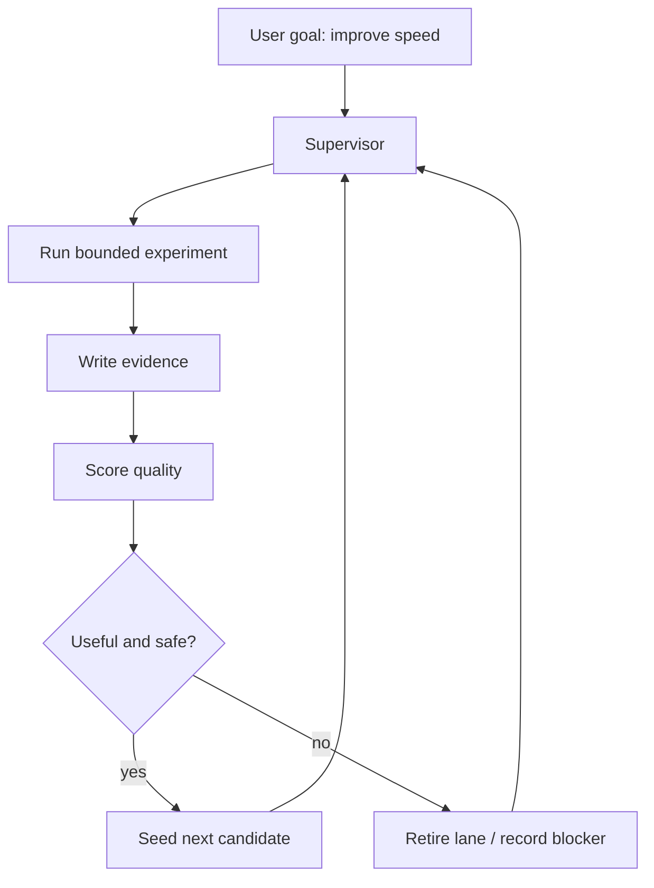
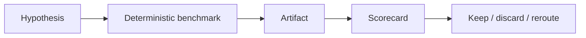
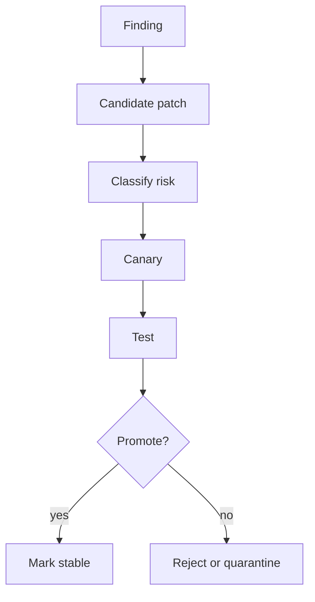

# Case Study: Turning A Fragile Local Agent Into A Speed Autoresearch Harness

## The Short Version

This project began with a simple frustration: the local OpenClaw setup could run
a powerful model, but it did not yet behave like a dependable product. It could
stall, loop, lose context, overrun memory, or ask for manual help halfway
through a long task. That made speed research especially painful. Every attempt
to improve decode performance first had to survive the harness itself.

The work evolved into a layered autoresearch system: one that could measure
speed, remember progress, reject noisy findings, route around dead ends, and
turn safe implementation ideas into canary-tested changes.

The story is not just "make tokens faster." It is about building the operating
system around local AI work so the model can do useful research without the user
having to babysit every failure mode.

## The Starting Point

The target experience was normal OpenClaw TUI usage: type a request, get a
response, run tools, and continue building. In practice, the early system had
three product-breaking problems:

- it could stop mid-task and leave the user wondering whether anything was
  happening;
- tool calls and reasoning output could loop or leak into the interface;
- long local inference runs could collide with memory pressure and crash-prone
  Python/Metal behavior.

Speed was the visible pain, but reliability was the hidden blocker. A faster
model path would not matter if the harness silently stalled, repeated old work,
or could not tell a real improvement from measurement noise.

## The Product Question

The guiding question became:

> Can a local agent harness research and improve its own performance while
> staying stable enough to trust overnight?

That turned the work into two connected tracks:

1. Improve the actual user-facing speed path.
2. Build an autoresearch loop that could keep producing trustworthy evidence.

## The Architecture Shift

The first major decision was to stop treating the LLM as the owner of the whole
loop. The model is useful for hypotheses, synthesis, and reasoning, but it is
not the right component to decide whether a task is safe, whether a benchmark is
valid, or whether a patch should touch production.

So the system moved toward a supervisor-owned architecture:

This kept the Karpathy-style autoresearch spirit: small experiments, visible
evidence, and keep/discard decisions. The difference was adding production
guardrails around it.

## What We Built

### 1. Runtime Protection

Before research could be useful, the harness needed to stop hurting itself.

We added memory preflights, active circuit breakers, stream watchdogs, and
bounded tool output. The system learned to treat local runtime failure as a
state to handle, not a mystery to leave to the user.

The key product improvement was psychological: when something was blocked, it
became visible and structured instead of feeling like the terminal had frozen.

### 2. Model-Agnostic Profiles

The OpenClaw gateway was kept model-agnostic. Runtime details moved into model
profiles: backend type, port, health checks, commands, logs, and memory class.

That made the harness easier to adapt. The research loop could focus on the
active profile without hardcoding every backend decision into the TUI or
gateway.

### 3. Deterministic Research Tasks

The early loop could produce research-like text without always creating useful
progress. The fix was to make benchmarks, quality review, task advancement, and
handoff checks deterministic wherever possible.

The model could still explain and hypothesize. The supervisor owned the facts.

### 4. Memory Across Runs

One of the most important UX lessons was that "restart the research" must not
mean "forget what happened." The system needed durable memory of:

- what had already been tried;
- what was blocked;
- which lanes were exhausted;
- which candidate paths still looked promising;
- what the next useful action should be.

This turned repeated overnight runs into a continuous investigation instead of
a series of disconnected attempts.

### 5. Implementation Handoff

Research is only valuable if it can change the system safely. We added an
implementation bridge that classifies patches, scans paths, runs canaries,
requires rollback evidence, and blocks high-risk changes unless sandbox evidence
exists.

The goal was to make "self-improvement" concrete:

## The Speed Track

The speed work focused on decode performance and perceived latency. The system
tested runtime settings, drafter behavior, speculative decoding paths, and
benchmark quality.

The important shift was learning to separate three different questions:

| Question | Why It Matters |
| --- | --- |
| Is the model generating faster? | Raw decode speed |
| Is the user seeing output sooner? | Time to first token and perceived speed |
| Is the measurement clean? | Avoids false wins from contaminated benchmarks |

The harness improved from an unstable, hard-to-trust loop into a system that
could repeatedly measure candidate paths and reject noisy progress.

## The Hard Part

The hardest part was not writing another benchmark. It was stopping the system
from rewarding fake progress.

Bad autoresearch can look busy while doing very little:

- repeating the same synthesis;
- rediscovering known blockers;
- generating "next steps" without running them;
- treating blocked rows as progress;
- losing context after restart;
- chasing a candidate after evidence says it is exhausted.

The supervisor had to learn to suppress lanes, retire dead ends, and route to
prerequisites instead of asking the model to "try again" forever.

## What Changed In The UX

The desired UX moved from:

> "The agent is stuck, so the user asks Codex what happened."

to:

> "The harness records the state, scores the run, decides the next bounded
> action, and only asks for help when the change is outside the safe envelope."

That is the core product design lesson of the project. Autonomy is not just more
agent freedom. Good autonomy is clearer ownership: deterministic code owns
safety and evidence; the model owns synthesis and idea generation.

## Portfolio Framing

This project sits at the intersection of AI UX, local inference engineering,
and agent orchestration.

The design challenge was not only "how do we make it faster?" It was:

- how do we make progress visible?
- how do we keep the user out of the loop without hiding risk?
- how do we stop a model from confusing activity with improvement?
- how do we let a system self-improve without letting it mutate itself into
  instability?

The final harness is best understood as a research cockpit for local agents:
metrics, guardrails, memory, canaries, and review loops wrapped around the model
so the system can keep moving without becoming reckless.

## Outcome

The result is a reusable autoresearch harness rather than a one-off speed script.

It can now:

- run profile-based research on different goals;
- record durable evidence;
- score quality and stability;
- remember exhausted lanes;
- gate implementation candidates;
- reject noisy or unsafe changes;
- provide a portfolio-readable trail of what was tried and why.

The speed story remains the motivating case study, but the system itself became
more general: a modular way to research, evaluate, and safely improve an
OpenClaw setup over time.

## What I Would Show In A Portfolio

### Problem

Local AI agents can be powerful but fragile. They need a harness that makes
their work measurable, recoverable, and trustworthy.

### Intervention

I designed and built an autoresearch layer that combines Karpathy-style
experimentation with production safety gates: memory checks, deterministic
supervision, evidence ledgers, watchdog reviews, implementation canaries, and
rollback rules.

### Result

The system moved from manual debugging and repeated stalls toward a reusable
autonomous research loop that can pursue speed improvements while preserving
stability.

### Design Principle

Autonomy should not mean "let the model do anything." Autonomy should mean the
system knows what it is allowed to do, how to prove it worked, and when to stop.
